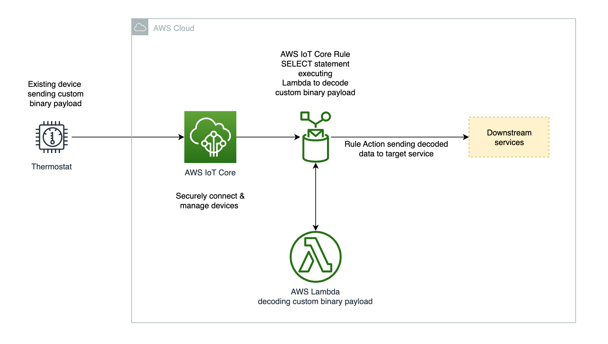

# Decoding a custom binary payload with .NET from an AWS IoT Core Rule

## Background

AWS IoT Core supports [executing Amazon Lambda functions directly from the Rule Engine SQL statement](https://docs.aws.amazon.com/iot/latest/developerguide/iot-sql-functions.html#iot-func-aws-lambda).

This feature is extremely useful in cases you have a custom payload and  you want to deserialize it to JSON to being able to further process within the SQL statement of the Rule and feed additional downstream services.

Consider this scenario: _You have an Industrial solution that currently utilizes a code-base developed in .NET, and you wish to connect to AWS IoT Core and make use of an encoding/decoding library that you are already familiar with._

_In such a case, you could leverage an Amazon Lambda function that has been coded in .NET directly reusing your libraries  from the AWS IoT Core Rule Engine._

In this repository you can find a sample Amazon Lambda and a Device Simulator which references a common serialization library.

In order to simplify the test of this example you can find a [CDK](https://aws.amazon.com/cdk/) Application written in .NET which deploy the AWS IoT Core Rule and the Lambda together with the necessary Roles.   

There is also another CDK Stack (within the same CDK Application) to deploy the test thing and associate the right policy to be able to publish to the topic which triggers the AWS IoT Core Rule.

# Architecture



# Requirements

-	AWS Account
-	AWS CLI & CDK
-	AWS IAM User with enough privileges to interact with AWS IoT Core and create the CDK stack. 
-	.NET 6.0 SDK (to run the simulator)
-	Docker (it's used by the CDK app to build the Lambda)

# Getting started

Let's start cloning the repo:

```bash
#to be changed with the final repo
git clone https://github.com/aws-samples/aws-iot-binary-payload-decoding-with-dotnet-lambda.git
cd aws-iot-binary-payload-decoding-with-dotnet-lambda
```

Then to deploy and execute this simple example you need first to create and activate a Certificate for the simulation which send a custom binary payload to AWS IoT Core.

```bash
cd src/deviceSimulator
mkdir Secrets
cd Secrets

# The following command is going to create a certifiate, set as Active and return back the ARN of that certificate and save into a variable to be used later in the CDK as context parameter
certArn=$(aws iot create-keys-and-certificate --set-as-active --certificate-pem-outfile certificate.crt --public-key-outfile public.key --private-key-outfile private.key --query certificateArn --output text)

```

If the command above is executed properly you now should have a certificate created in AWS IoT Core, set as Active and a variable in your console with the ARN.

You can simply check in this way:


```bash
echo $certArn

# You should see the Certificate ARN created above as an output of this command.
# Something like: arn:aws:iot:<region>:<account>:cert/<the id of your cert>
```

In order to run the device simulator you need also to download the [Amazon Root CA](https://docs.aws.amazon.com/iot/latest/developerguide/iot-dc-prepare-device-test.html#iot-dc-prepare-device-test-step3).

```bash
curl -o AmazonRootCA1.pem https://www.amazontrust.com/repository/AmazonRootCA1.pem

chmod 644 AmazonRootCA1.pem
```

The next step is deploy the CDK stack.  This is going to create the AWS IoT Core Rule, deploy the Lambda, configure the necessary roles, create a thing in AWS IoT Core, assign the necessary policy to the Certificate you create above and assign the thing to the Certificate as well.

_NOTE: if you want you can replace the thingName and the encoded and decoded topic used by the simulator and by the Rule to republish the decoded values_

```bash
# Go back to the root of the repo then execute the following commands:

cd infra
cdk deploy --all --context thingName=mySimulationThing --context thingCertArn=$certArn --context encodedDataTopic=encodedData --context decodedDataTopic=decodedData
```

You should have now the stack deployed!

The next step is to edit the device simulator configuration file that you can find here: ```<repositorRoot>/deviceSimulator/deviceSimulatorConfig.json ```.

You need to update the "Endpoint" attribute with your AWS IoT Core Data-ATS endpoint, you can find [here](https://docs.aws.amazon.com/general/latest/gr/iot-core.html) more information about the endpoints.

A simple way to get the endpoint is executing the following command:

```bash
aws iot describe-endpoint --endpoint-type iot:Data-ATS
```

Now you can update the ```deviceSimulatorConfig.json ``` file.

```bash
{
  "Endpoint": "<AWS IoT Core 'iot:Data-ATS' endpoint>",
  "EncodedDataTopic" :"encodedData",
  "ClientId": "mySimulationThing",
  "ClientCertificatePath": "./Secrets/certificate.crt",
  "ClientPrivateKeyPath": "./Secrets/private.key",
  "CaCertificatePath": "./Secrets/AmazonRootCA1.pem"
}
```

NOTE: if you changed teh thingName when deployng the CDK Application then you need to update also the ClientId to the same thingName.

## Executing

Open the AWS IoT Core console and open the MQTT test client.

Subscribe to both the ```encodedDataTopic``` and ```decodedDataTopic``` you provided in the CDK context (and the device simulator).

To start the device simulator just move into the ```<repositorRoot>/deviceSimulator/ ``` folder and execute the following command:

```bash
dotnet run
```

You shouuld see the device simulator connecting and sending a simulated binary payload into the ```encodedDataTopic``` topic.

Rule Engine would trigger the Lambda, the Lambda decode the custom payload and the Rule republish it decoded into the 
```decodedDataTopic```.


## Cleanup
In order to cleanup the entities deployed you can just destroy the CDK Stack with the following command from the "infra" folder of your local copy of this repository:
```bash
cdk destroy --all --context thingName=mySimulationThing --context thingCertArn=$certArn --context encodedDataTopic=encodedData --context decodedDataTopic=decodedData
```

Then you need to deactivate and delete the certificate. 
You can find additional details [here](https://docs.aws.amazon.com/iot/latest/developerguide/activate-or-deactivate-device-cert.html)


## Security

See [CONTRIBUTING](CONTRIBUTING.md#security-issue-notifications) for more information.

## License

This library is licensed under the MIT-0 License. See the LICENSE file.
